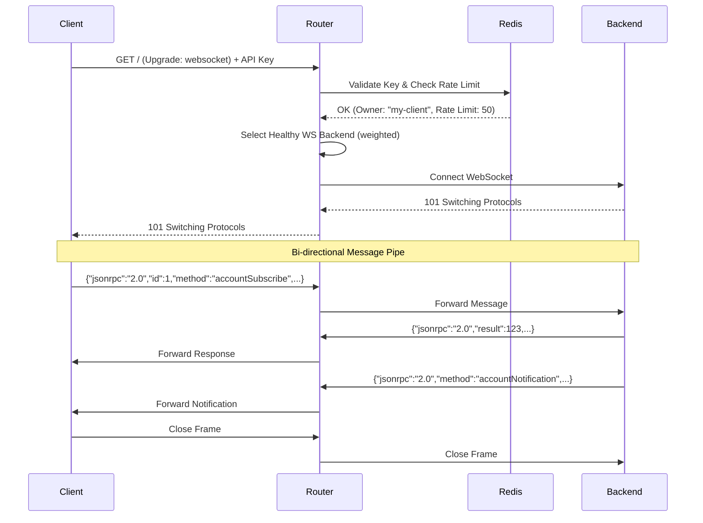

## WebSocket Overview

The router proxies WebSocket connections to backend Solana RPC nodes, enabling subscription methods like `accountSubscribe`, `logsSubscribe`, and `slotSubscribe`. WebSocket connections use the same authentication, rate limiting, and weighted load balancing as HTTP requests.

### Connection Methods

Clients can connect via two equivalent endpoints:

1. **Main HTTP Port**: `GET /` with `Upgrade: websocket` header
2. **Dedicated WebSocket Port**: HTTP port + 1 (e.g., if HTTP is 28899, WebSocket is 28900)

---

## GET / (WebSocket Upgrade)

Upgrade an HTTP connection to WebSocket and proxy to a backend Solana RPC node.

### Connection URL

```
ws://host:port/?api-key=YOUR_API_KEY
```

or

```
ws://host:port+1/?api-key=YOUR_API_KEY
```

### Authentication

WebSocket connections require an API key passed as a query parameter:

```
ws://rpc.example.com:28899/?api-key=YOUR_API_KEY
```

Authentication is validated before the upgrade completes. Failed auth returns standard HTTP error responses:

- `401 Unauthorized`: Invalid or missing API key
- `429 Too Many Requests`: Rate limit exceeded
- `500 Internal Server Error`: Redis connection error
- `503 Service Unavailable`: No healthy WebSocket backends available

### Backend Selection

The router selects backends with WebSocket support (`ws_url` configured) using weighted random selection among healthy backends. Backends without `ws_url` are excluded from WebSocket routing.

**Configuration:**

```toml
[[backends]]
label  = "mainnet-primary"
url    = "https://api.mainnet-beta.solana.com"      # HTTP URL
ws_url = "wss://api.mainnet-beta.solana.com"       # WebSocket URL (required)
weight = 10

[[backends]]
label  = "http-only-backend"
url    = "https://rpc.example.com"
weight = 5
# No ws_url - excluded from WebSocket routing
```

### Connection Lifecycle



### Message Forwarding

All WebSocket frames are relayed transparently between client and backend:

- **Text**: JSON-RPC subscription requests/responses/notifications
- **Binary**: Raw binary data (if used by backend)
- **Ping/Pong**: Keepalive frames (forwarded bidirectionally)
- **Close**: Graceful shutdown signal

When either side closes the connection or errors, the router shuts down both directions.

### Supported Subscription Methods

The router transparently proxies all Solana WebSocket subscription methods:

<ResponseField name="accountSubscribe" type="subscription">
  Subscribe to account data changes
</ResponseField>

<ResponseField name="logsSubscribe" type="subscription">
  Subscribe to transaction logs
</ResponseField>

<ResponseField name="programSubscribe" type="subscription">
  Subscribe to program account changes
</ResponseField>

<ResponseField name="signatureSubscribe" type="subscription">
  Subscribe to transaction confirmation
</ResponseField>

<ResponseField name="slotSubscribe" type="subscription">
  Subscribe to slot changes
</ResponseField>

<ResponseField name="slotsUpdatesSubscribe" type="subscription">
  Subscribe to slot update notifications
</ResponseField>

<ResponseField name="rootSubscribe" type="subscription">
  Subscribe to root changes
</ResponseField>

<ResponseField name="voteSubscribe" type="subscription">
  Subscribe to vote transactions
</ResponseField>

### Connection Examples

<CodeGroup>

```javascript JavaScript (ws)
const WebSocket = require('ws');

const ws = new WebSocket('ws://rpc.example.com:28899/?api-key=YOUR_API_KEY');

ws.on('open', () => {
  console.log('Connected');
  
  // Subscribe to account changes
  ws.send(JSON.stringify({
    jsonrpc: '2.0',
    id: 1,
    method: 'accountSubscribe',
    params: [
      'vines1vzrYbzLMRdu58ou5XTby4qAqVRLmqo36NKPTg',
      { encoding: 'jsonParsed' }
    ]
  }));
});

ws.on('message', (data) => {
  const msg = JSON.parse(data);
  console.log('Received:', msg);
  
  if (msg.method === 'accountNotification') {
    console.log('Account updated:', msg.params);
  }
});

ws.on('error', (err) => {
  console.error('WebSocket error:', err);
});

ws.on('close', () => {
  console.log('Disconnected');
});
```

```python Python (websockets)
import asyncio
import websockets
import json

async def subscribe_to_slot():
    uri = "ws://rpc.example.com:28899/?api-key=YOUR_API_KEY"
    
    async with websockets.connect(uri) as ws:
        # Subscribe to slot updates
        await ws.send(json.dumps({
            "jsonrpc": "2.0",
            "id": 1,
            "method": "slotSubscribe"
        }))
        
        # Receive subscription confirmation
        response = await ws.recv()
        print(f"Subscription: {response}")
        
        # Listen for notifications
        async for message in ws:
            data = json.loads(message)
            if data.get('method') == 'slotNotification':
                slot = data['params']['result']['slot']
                print(f"New slot: {slot}")

asyncio.run(subscribe_to_slot())
```

```bash wscat CLI
# Install: npm install -g wscat
wscat -c "ws://rpc.example.com:28899/?api-key=YOUR_API_KEY"

# After connection, send subscription:
{"jsonrpc":"2.0","id":1,"method":"slotSubscribe"}

# Receive notifications:
{"jsonrpc":"2.0","method":"slotNotification","params":{"result":{"slot":123456789},"subscription":0}}
```

```rust Rust (tokio-tungstenite)
use tokio_tungstenite::{connect_async, tungstenite::Message};
use futures_util::{SinkExt, StreamExt};
use serde_json::json;

#[tokio::main]
async fn main() {
    let url = "ws://rpc.example.com:28899/?api-key=YOUR_API_KEY";
    let (ws_stream, _) = connect_async(url).await.expect("Failed to connect");
    let (mut write, mut read) = ws_stream.split();
    
    // Subscribe to logs
    let subscribe = json!({
        "jsonrpc": "2.0",
        "id": 1,
        "method": "logsSubscribe",
        "params": [
            {"mentions": ["TokenkegQfeZyiNwAJbNbGKPFXCWuBvf9Ss623VQ5DA"]},
            {"commitment": "finalized"}
        ]
    });
    
    write.send(Message::Text(subscribe.to_string())).await.unwrap();
    
    while let Some(msg) = read.next().await {
        match msg {
            Ok(Message::Text(text)) => {
                println!("Received: {}", text);
            }
            Ok(Message::Close(_)) => break,
            Err(e) => {
                eprintln!("Error: {}", e);
                break;
            }
            _ => {}
        }
    }
}
```

</CodeGroup>

### Error Responses

<ResponseField name="401 Unauthorized" type="string">
  Returned before upgrade when:
  - No `api-key` query parameter provided
  - Invalid API key
  - API key is inactive
  
  Response body: `"Unauthorized"`
</ResponseField>

<ResponseField name="429 Too Many Requests" type="string">
  Returned when the API key exceeds its rate limit during connection attempt.
  
  Response body: `"Rate limit exceeded"`
</ResponseField>

<ResponseField name="500 Internal Server Error" type="string">
  Returned when Redis connection fails during key validation.
  
  Response body: `"Internal Server Error"`
</ResponseField>

<ResponseField name="503 Service Unavailable" type="string">
  Returned when no healthy backends with `ws_url` configured are available.
  
  Response body: `"No healthy WebSocket backends available"`
</ResponseField>

### Rate Limiting

WebSocket connections are rate limited at connection time using the same Redis-backed mechanism as HTTP requests:

1. API key is validated and rate limit checked **before** the upgrade
2. If rate limit is exceeded, connection is rejected with `429 Too Many Requests`
3. After successful upgrade, messages are **not** individually rate limited
4. Long-lived connections do not count against the per-second rate limit

### Metrics

WebSocket connections emit the following metrics (see [Metrics Endpoint](/api/metrics-endpoint) for details):

- `ws_connections_total`: Counter of connection attempts by status
- `ws_active_connections`: Gauge of currently open connections
- `ws_messages_total`: Counter of messages relayed (client→backend, backend→client)
- `ws_connection_duration_seconds`: Histogram of connection lifetimes

All metrics include `backend` and `owner` labels for granular analysis.

### Monitoring Active Connections

```bash Query Active Connections
curl -s http://localhost:9090/metrics | grep ws_active_connections

# Output:
ws_active_connections{backend="mainnet-primary",owner="my-client"} 12
ws_active_connections{backend="backup-rpc",owner="other-client"} 5
```

### Connection Timeout

WebSocket connections do not have an idle timeout. Connections remain open until:

- Client sends a Close frame
- Backend sends a Close frame
- Network error or connection loss
- Router shutdown

Clients should implement reconnection logic with exponential backoff for production use.

### Best Practices

1. **Reconnection Logic**: Implement automatic reconnection with exponential backoff
2. **Heartbeat**: Use Ping/Pong frames to detect stale connections
3. **Error Handling**: Handle backend disconnects and router restarts gracefully
4. **Subscription Management**: Track subscription IDs and resubscribe on reconnect
5. **Rate Limit Headroom**: Ensure API key rate limits account for subscription setup traffic

### Example: Reconnection with Backoff

```javascript Reconnection Logic
class ResilientWebSocket {
  constructor(url) {
    this.url = url;
    this.reconnectDelay = 1000;
    this.maxReconnectDelay = 30000;
    this.connect();
  }
  
  connect() {
    this.ws = new WebSocket(this.url);
    
    this.ws.on('open', () => {
      console.log('Connected');
      this.reconnectDelay = 1000; // Reset backoff
      this.resubscribe();
    });
    
    this.ws.on('close', () => {
      console.log(`Disconnected, reconnecting in ${this.reconnectDelay}ms`);
      setTimeout(() => this.connect(), this.reconnectDelay);
      this.reconnectDelay = Math.min(this.reconnectDelay * 2, this.maxReconnectDelay);
    });
    
    this.ws.on('error', (err) => {
      console.error('WebSocket error:', err);
      this.ws.close();
    });
  }
  
  resubscribe() {
    // Re-establish subscriptions after reconnect
    this.ws.send(JSON.stringify({
      jsonrpc: '2.0',
      id: 1,
      method: 'slotSubscribe'
    }));
  }
}

const ws = new ResilientWebSocket('ws://rpc.example.com:28899/?api-key=YOUR_API_KEY');
```