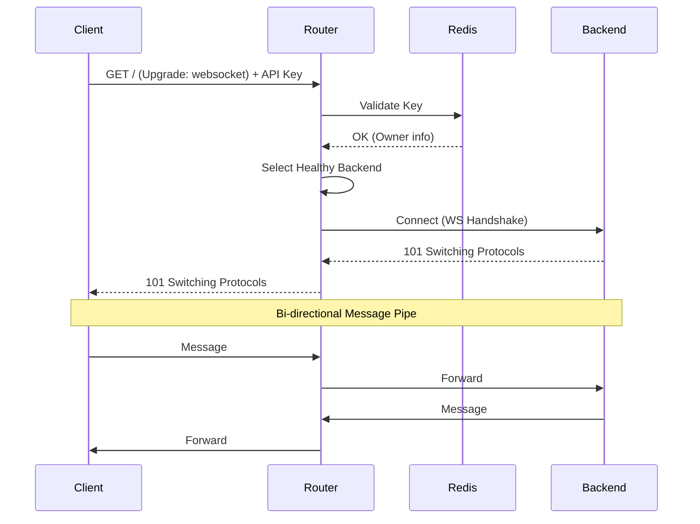

## Overview

Sol RPC Router provides transparent WebSocket proxying for Solana subscription methods (`accountSubscribe`, `logsSubscribe`, `programSubscribe`, etc.) with the same authentication, rate limiting, and weighted load balancing as HTTP requests.

## Connection Lifecycle

### Sequence Diagram



### Connection Flow

<Steps>
  <Step title="Upgrade Request">
    Client initiates WebSocket upgrade with API key:
    
    ```javascript
    const ws = new WebSocket('ws://localhost:28899/?api-key=your-key-here');
    ```
    
    The router accepts upgrades on:
    - **Main HTTP port** (default 28899): `GET /` with `Upgrade: websocket` header
    - **Dedicated WS port** (HTTP port + 1, default 28900): `GET /`
  </Step>
  
  <Step title="Authentication">
    API key validation occurs **before** the upgrade completes (src/handlers.rs:355-387):
    
    ```rust src/handlers.rs
    let api_key = match params.api_key {
        Some(k) => k,
        None => {
            counter!("ws_connections_total", 
                "backend" => "none", 
                "owner" => "none", 
                "status" => "auth_failed").increment(1);
            return (StatusCode::UNAUTHORIZED, "Unauthorized").into_response();
        }
    };
    
    let owner = match state.keystore.validate_key(&api_key).await {
        Ok(Some(info)) => info.owner,
        Ok(None) => {
            counter!("ws_connections_total", 
                "backend" => "none", 
                "owner" => "none", 
                "status" => "auth_failed").increment(1);
            return (StatusCode::UNAUTHORIZED, "Unauthorized").into_response();
        }
        Err(e) if e == "Rate limit exceeded" => {
            counter!("ws_connections_total", 
                "backend" => "none", 
                "owner" => "none", 
                "status" => "rate_limited").increment(1);
            return (StatusCode::TOO_MANY_REQUESTS, "Rate limit exceeded")
                .into_response();
        }
        _ => { /* error handling */ }
    };
    ```
    
    Failed authentication returns HTTP error codes before the upgrade.
  </Step>
  
  <Step title="Backend Selection">
    Select a healthy backend with `ws_url` configured (src/state.rs:108-146):
    
    ```rust src/state.rs
    pub fn select_ws_backend(&self) -> Option<(String, String)> {
        let state = self.state.load();
        
        let ws_backends: Vec<&RuntimeBackend> = state
            .backends
            .iter()
            .filter(|b| b.config.ws_url.is_some() && b.healthy.load(Ordering::Relaxed))
            .collect();
        
        // Weighted random selection (same algorithm as HTTP)
    }
    ```
    
    Only backends with `ws_url` are eligible for WebSocket connections.
  </Step>
  
  <Step title="Backend Connection">
    Router establishes WebSocket to selected backend (src/handlers.rs:425-435):
    
    ```rust src/handlers.rs
    let backend_socket = match connect_async(&backend_url).await {
        Ok((socket, _)) => socket,
        Err(e) => {
            error!("WebSocket: Failed to connect to backend {} ({}): {}",
                backend_label, backend_url, e);
            counter!("ws_connections_total", 
                "backend" => backend_label, 
                "owner" => owner, 
                "status" => "backend_connect_failed").increment(1);
            return;
        }
    };
    ```
    
    Connection failures are logged and tracked in metrics.
  </Step>
  
  <Step title="Bi-directional Forwarding">
    Two concurrent tasks forward frames in each direction (src/handlers.rs:456-546):
    
    ```rust src/handlers.rs
    // Split both connections
    let (mut client_write, mut client_read) = client_socket.split();
    let (mut backend_write, mut backend_read) = backend_socket.split();
    
    // Forward client -> backend
    let client_to_backend = async {
        while let Some(msg) = client_read.next().await {
            match msg {
                Ok(Message::Text(text)) => {
                    counter!("ws_messages_total", 
                        "backend" => bl1.clone(), 
                        "owner" => ow1.clone(), 
                        "direction" => "client_to_backend").increment(1);
                    if backend_write.send(TungsteniteMessage::Text(text)).await.is_err() {
                        break;
                    }
                }
                // ... Binary, Ping, Pong handling
            }
        }
    };
    
    // Forward backend -> client
    let backend_to_client = async {
        while let Some(msg) = backend_read.next().await {
            // Mirror logic for backend -> client
        }
    };
    
    // Run both directions concurrently
    tokio::select! {
        _ = client_to_backend => {
            let _ = backend_write.send(TungsteniteMessage::Close(None)).await;
        },
        _ = backend_to_client => {
            let _ = client_write.send(Message::Close(None)).await;
        },
    }
    ```
    
    Both directions run concurrently via `tokio::select!`, stopping when either side closes.
  </Step>
  
  <Step title="Cleanup">
    On disconnect, metrics are updated and resources released (src/handlers.rs:548-555):
    
    ```rust src/handlers.rs
    let duration = connect_time.elapsed().as_secs_f64();
    gauge!("ws_active_connections", 
        "backend" => backend_label.clone(), 
        "owner" => owner.clone()).decrement(1.0);
    histogram!("ws_connection_duration_seconds", 
        "backend" => backend_label.clone(), 
        "owner" => owner.clone()).record(duration);
    
    info!("WebSocket: {} disconnected from backend {} (duration={:.1}s)",
        client_addr, backend_label, duration);
    ```
  </Step>
</Steps>

## Message Forwarding

### Supported Frame Types

The proxy transparently forwards all WebSocket frame types:

| Frame Type | Client → Backend | Backend → Client | Metrics Tracked |
|------------|------------------|------------------|------------------|
| **Text** | ✓ | ✓ | Yes (`ws_messages_total`) |
| **Binary** | ✓ | ✓ | Yes (`ws_messages_total`) |
| **Ping** | ✓ | ✓ | No |
| **Pong** | ✓ | ✓ | No |
| **Close** | ✓ (terminates) | ✓ (terminates) | No |

### Client to Backend

Implementation in `src/handlers.rs:457-501`:

```rust src/handlers.rs
let client_to_backend = async {
    while let Some(msg) = client_read.next().await {
        match msg {
            Ok(Message::Text(text)) => {
                counter!("ws_messages_total", 
                    "backend" => bl1.clone(), 
                    "owner" => ow1.clone(), 
                    "direction" => "client_to_backend").increment(1);
                if backend_write
                    .send(TungsteniteMessage::Text(text))
                    .await
                    .is_err()
                {
                    break;
                }
            }
            Ok(Message::Binary(data)) => {
                counter!("ws_messages_total", 
                    "backend" => bl1.clone(), 
                    "owner" => ow1.clone(), 
                    "direction" => "client_to_backend").increment(1);
                if backend_write
                    .send(TungsteniteMessage::Binary(data))
                    .await
                    .is_err()
                {
                    break;
                }
            }
            Ok(Message::Ping(data)) => {
                if backend_write
                    .send(TungsteniteMessage::Ping(data))
                    .await
                    .is_err()
                {
                    break;
                }
            }
            Ok(Message::Pong(data)) => {
                if backend_write
                    .send(TungsteniteMessage::Pong(data))
                    .await
                    .is_err()
                {
                    break;
                }
            }
            Ok(Message::Close(_)) | Err(_) => break,
        }
    }
};
```

### Backend to Client

Mirror implementation in `src/handlers.rs:504-534`:

```rust src/handlers.rs
let backend_to_client = async {
    while let Some(msg) = backend_read.next().await {
        match msg {
            Ok(TungsteniteMessage::Text(text)) => {
                counter!("ws_messages_total", 
                    "backend" => bl2.clone(), 
                    "owner" => ow2.clone(), 
                    "direction" => "backend_to_client").increment(1);
                if client_write.send(Message::Text(text)).await.is_err() {
                    break;
                }
            }
            Ok(TungsteniteMessage::Binary(data)) => {
                counter!("ws_messages_total", 
                    "backend" => bl2.clone(), 
                    "owner" => ow2.clone(), 
                    "direction" => "backend_to_client").increment(1);
                if client_write.send(Message::Binary(data)).await.is_err() {
                    break;
                }
            }
            Ok(TungsteniteMessage::Ping(data)) => {
                if client_write.send(Message::Ping(data)).await.is_err() {
                    break;
                }
            }
            Ok(TungsteniteMessage::Pong(data)) => {
                if client_write.send(Message::Pong(data)).await.is_err() {
                    break;
                }
            }
            Ok(TungsteniteMessage::Close(_)) | Ok(TungsteniteMessage::Frame(_)) | Err(_) => {
                break
            }
        }
    }
};
```

<Note>
Only **Text** and **Binary** frames increment the `ws_messages_total` counter. Ping/Pong frames are forwarded transparently without metrics tracking.
</Note>

## Connection Termination

Connections terminate when:

1. **Client Closes**: Client sends Close frame or disconnects
2. **Backend Closes**: Backend sends Close frame or disconnects
3. **Write Error**: Send operation fails on either side
4. **Read Error**: Receive operation fails on either side

Termination logic (src/handlers.rs:537-546):

```rust src/handlers.rs
tokio::select! {
    _ = client_to_backend => {
        // Client side ended; send close to backend
        let _ = backend_write.send(TungsteniteMessage::Close(None)).await;
    },
    _ = backend_to_client => {
        // Backend side ended; send close to client
        let _ = client_write.send(Message::Close(None)).await;
    },
}
```

When one direction terminates, the router sends a Close frame to the other side.

## Metrics

WebSocket connections emit comprehensive metrics tracked by backend and owner.

### Available Metrics

| Metric | Type | Labels | Description |
|--------|------|--------|-------------|
| `ws_connections_total` | Counter | `backend`, `owner`, `status` | Connection attempts with status (`connected`, `auth_failed`, `rate_limited`, `no_backend`, `backend_connect_failed`, `error`) |
| `ws_active_connections` | Gauge | `backend`, `owner` | Currently open WebSocket sessions |
| `ws_messages_total` | Counter | `backend`, `owner`, `direction` | Frames relayed (`client_to_backend` / `backend_to_client`) |
| `ws_connection_duration_seconds` | Histogram | `backend`, `owner` | Session duration from upgrade to close |

### Connection Status Values

The `ws_connections_total` counter uses these `status` label values:

<Tabs>
  <Tab title="connected">
    Successful upgrade and backend connection established.
    
    ```rust src/handlers.rs
    counter!("ws_connections_total", 
        "backend" => backend_label.clone(), 
        "owner" => owner.clone(), 
        "status" => "connected").increment(1);
    ```
  </Tab>
  
  <Tab title="auth_failed">
    Invalid API key or missing `api-key` parameter.
    
    ```rust src/handlers.rs
    counter!("ws_connections_total", 
        "backend" => "none", 
        "owner" => "none", 
        "status" => "auth_failed").increment(1);
    ```
  </Tab>
  
  <Tab title="rate_limited">
    API key exceeded rate limit.
    
    ```rust src/handlers.rs
    counter!("ws_connections_total", 
        "backend" => "none", 
        "owner" => "none", 
        "status" => "rate_limited").increment(1);
    ```
  </Tab>
  
  <Tab title="no_backend">
    No healthy backends with `ws_url` configured.
    
    ```rust src/handlers.rs
    counter!("ws_connections_total", 
        "backend" => "none", 
        "owner" => owner.clone(), 
        "status" => "no_backend").increment(1);
    ```
  </Tab>
  
  <Tab title="backend_connect_failed">
    Router failed to establish connection to backend WebSocket.
    
    ```rust src/handlers.rs
    counter!("ws_connections_total", 
        "backend" => backend_label, 
        "owner" => owner, 
        "status" => "backend_connect_failed").increment(1);
    ```
  </Tab>
  
  <Tab title="error">
    Internal error during key validation (Redis error).
    
    ```rust src/handlers.rs
    counter!("ws_connections_total", 
        "backend" => "none", 
        "owner" => "none", 
        "status" => "error").increment(1);
    ```
  </Tab>
</Tabs>

### Prometheus Queries

<CodeGroup>

```promql Active Connections
# Current active connections per backend
ws_active_connections{}

# Total active connections
sum(ws_active_connections)

# Active connections by owner
sum by (owner) (ws_active_connections)
```

```promql Connection Rate
# Successful connections per second
rate(ws_connections_total{status="connected"}[5m])

# Failed connection rate
rate(ws_connections_total{status!="connected"}[5m])

# Connection success rate
sum(rate(ws_connections_total{status="connected"}[5m]))
  / sum(rate(ws_connections_total[5m]))
```

```promql Message Throughput
# Messages per second per backend
rate(ws_messages_total[5m])

# Client to backend message rate
rate(ws_messages_total{direction="client_to_backend"}[5m])

# Backend to client message rate
rate(ws_messages_total{direction="backend_to_client"}[5m])
```

```promql Connection Duration
# Average connection duration
rate(ws_connection_duration_seconds_sum[5m])
  / rate(ws_connection_duration_seconds_count[5m])

# 95th percentile connection duration
histogram_quantile(0.95, 
  rate(ws_connection_duration_seconds_bucket[5m]))
```

</CodeGroup>

## Configuration

### Backend Setup

Enable WebSocket support by adding `ws_url` to backend configuration:

```toml config.toml
[[backends]]
label = "mainnet-primary"
url = "https://api.mainnet-beta.solana.com"
ws_url = "wss://api.mainnet-beta.solana.com"  # WebSocket enabled
weight = 10

[[backends]]
label = "http-only-backend"
url = "https://http-only.example.com"
# No ws_url - excluded from WebSocket routing
weight = 5
```

<Warning>
Backends without `ws_url` continue to serve HTTP requests but return `503 Service Unavailable` for WebSocket upgrades if they're the only backends available.
</Warning>

### Port Configuration

WebSockets are available on two ports:

```toml config.toml
port = 28899  # HTTP port (also accepts WebSocket upgrades)
# WebSocket-only port automatically set to 28900 (port + 1)
```

<CodeGroup>

```javascript Main Port (HTTP + WS)
// WebSocket upgrade on main HTTP port
const ws = new WebSocket('ws://localhost:28899/?api-key=your-key-here');
```

```javascript Dedicated WS Port
// WebSocket-only port (HTTP port + 1)
const ws = new WebSocket('ws://localhost:28900/?api-key=your-key-here');
```

</CodeGroup>

Port allocation logic (src/main.rs:216-221):

```rust src/main.rs
let ws_port = config
    .port
    .checked_add(1)
    .expect("WebSocket port overflow: HTTP port cannot be 65535");
let ws_addr = SocketAddr::from(([0, 0, 0, 0], ws_port));
```

## Usage Examples

### JavaScript/TypeScript

```javascript
// Establish WebSocket connection
const ws = new WebSocket('ws://localhost:28899/?api-key=your-key-here');

ws.onopen = () => {
  console.log('Connected');
  
  // Subscribe to account updates
  ws.send(JSON.stringify({
    jsonrpc: '2.0',
    id: 1,
    method: 'accountSubscribe',
    params: [
      'AccountPublicKey...',
      { encoding: 'jsonParsed' }
    ]
  }));
};

ws.onmessage = (event) => {
  const data = JSON.parse(event.data);
  console.log('Received:', data);
};

ws.onerror = (error) => {
  console.error('WebSocket error:', error);
};

ws.onclose = () => {
  console.log('Disconnected');
};
```

### Solana Web3.js

```javascript
import { Connection } from '@solana/web3.js';

const connection = new Connection(
  'ws://localhost:28899/?api-key=your-key-here',
  'confirmed'
);

const subscriptionId = connection.onAccountChange(
  publicKey,
  (accountInfo) => {
    console.log('Account updated:', accountInfo);
  },
  'confirmed'
);

// Unsubscribe when done
connection.removeAccountChangeListener(subscriptionId);
```

### Python

```python
import asyncio
import json
import websockets

async def subscribe():
    uri = "ws://localhost:28899/?api-key=your-key-here"
    
    async with websockets.connect(uri) as websocket:
        # Subscribe to account
        subscribe_msg = {
            "jsonrpc": "2.0",
            "id": 1,
            "method": "accountSubscribe",
            "params": [
                "AccountPublicKey...",
                {"encoding": "jsonParsed"}
            ]
        }
        await websocket.send(json.dumps(subscribe_msg))
        
        # Receive updates
        while True:
            response = await websocket.recv()
            data = json.loads(response)
            print(f"Received: {data}")

asyncio.run(subscribe())
```

### Rust

```rust
use tokio_tungstenite::{connect_async, tungstenite::Message};
use futures_util::{SinkExt, StreamExt};

#[tokio::main]
async fn main() {
    let url = "ws://localhost:28899/?api-key=your-key-here";
    let (ws_stream, _) = connect_async(url).await.expect("Failed to connect");
    let (mut write, mut read) = ws_stream.split();
    
    // Subscribe to account
    let subscribe_msg = r#"{
        "jsonrpc": "2.0",
        "id": 1,
        "method": "accountSubscribe",
        "params": ["AccountPublicKey...", {"encoding": "jsonParsed"}]
    }"#;
    
    write.send(Message::Text(subscribe_msg.to_string()))
        .await
        .expect("Failed to send");
    
    // Receive updates
    while let Some(msg) = read.next().await {
        match msg {
            Ok(Message::Text(text)) => println!("Received: {}", text),
            Err(e) => eprintln!("Error: {}", e),
            _ => {}
        }
    }
}
```

## Supported Subscription Methods

All Solana WebSocket subscription methods are supported:

<CardGroup cols={2}>
  <Card title="accountSubscribe" icon="wallet">
    Subscribe to account updates
  </Card>
  <Card title="logsSubscribe" icon="file-lines">
    Subscribe to transaction logs
  </Card>
  <Card title="programSubscribe" icon="code">
    Subscribe to program account updates
  </Card>
  <Card title="signatureSubscribe" icon="signature">
    Subscribe to transaction confirmations
  </Card>
  <Card title="slotSubscribe" icon="clock">
    Subscribe to slot updates
  </Card>
  <Card title="rootSubscribe" icon="tree">
    Subscribe to root updates
  </Card>
  <Card title="voteSubscribe" icon="check-to-slot">
    Subscribe to vote account updates
  </Card>
  <Card title="blockSubscribe" icon="cube">
    Subscribe to block updates
  </Card>
</CardGroup>

All subscription methods and their corresponding `*Unsubscribe` methods work transparently through the proxy.

## Troubleshooting

<AccordionGroup>
  <Accordion title="401 Unauthorized on Upgrade">
    **Cause**: Missing or invalid API key.
    
    **Solution**:
    ```javascript
    // Ensure api-key is in query string
    const ws = new WebSocket('ws://localhost:28899/?api-key=your-key-here');
    ```
    
    Check metrics:
    ```promql
    ws_connections_total{status="auth_failed"}
    ```
  </Accordion>
  
  <Accordion title="503 No Healthy Backends">
    **Cause**: No backends with `ws_url` are healthy.
    
    **Solution**:
    1. Check backend health: `curl http://localhost:28899/health`
    2. Verify `ws_url` is configured in `config.toml`
    3. Check backend WebSocket endpoints are reachable
    
    Check metrics:
    ```promql
    ws_connections_total{status="no_backend"}
    ```
  </Accordion>
  
  <Accordion title="Connection Drops Immediately">
    **Cause**: Backend connection failure or authentication issue.
    
    **Solution**:
    - Check logs for "Failed to connect to backend"
    - Verify backend `ws_url` is correct and accessible
    - Test backend WebSocket directly:
      ```bash
      wscat -c wss://api.mainnet-beta.solana.com
      ```
    
    Check metrics:
    ```promql
    ws_connections_total{status="backend_connect_failed"}
    ```
  </Accordion>
  
  <Accordion title="Messages Not Forwarding">
    **Cause**: Frame type incompatibility or connection error.
    
    **Solution**:
    - Check `ws_messages_total` metrics for both directions
    - Verify messages are valid JSON-RPC 2.0 format
    - Check logs for send/receive errors
    
    Debug query:
    ```promql
    # Should show equal rates for healthy connections
    rate(ws_messages_total{direction="client_to_backend"}[5m])
    rate(ws_messages_total{direction="backend_to_client"}[5m])
    ```
  </Accordion>
</AccordionGroup>

## Performance Considerations

<AccordionGroup>
  <Accordion title="Connection Limits">
    No hard limit on concurrent connections, but consider:
    - OS file descriptor limits (ulimit)
    - Backend connection limits
    - Memory usage (~10KB per connection for buffers)
    
    Monitor:
    ```promql
    sum(ws_active_connections)
    ```
  </Accordion>
  
  <Accordion title="Message Buffering">
    The proxy uses default Tokio WebSocket buffers:
    - No additional buffering layer
    - Back-pressure applied if send fails
    - Messages forwarded immediately upon receipt
  </Accordion>
  
  <Accordion title="Connection Duration">
    Long-lived connections are normal for subscriptions:
    - No automatic timeout or keep-alive
    - Backend may implement its own timeouts
    - Ping/Pong frames forwarded transparently
    
    Monitor duration:
    ```promql
    histogram_quantile(0.95, 
      rate(ws_connection_duration_seconds_bucket[5m]))
    ```
  </Accordion>
</AccordionGroup>