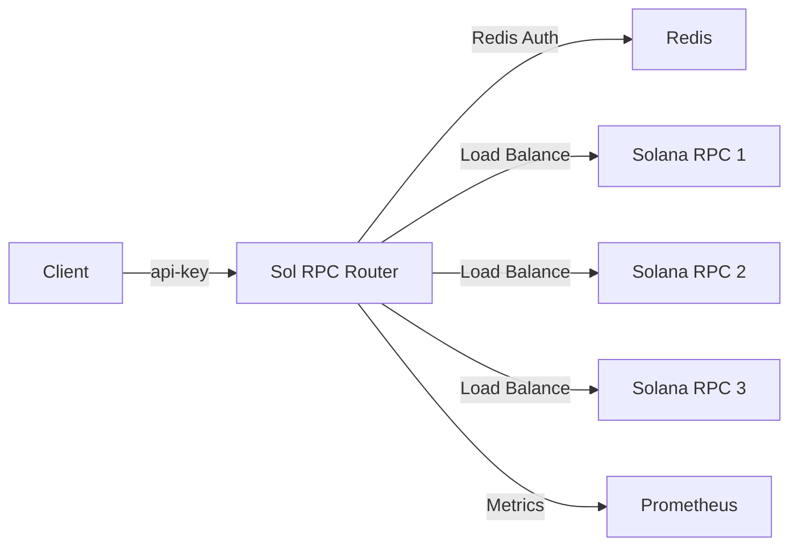

## Welcome to Sol RPC Router

Sol RPC Router is a production-ready reverse proxy designed specifically for Solana infrastructure. Built with Rust for maximum performance, it provides enterprise-grade API key authentication, per-key rate limiting, weighted load balancing, and automatic health monitoring for your Solana RPC endpoints.

<CardGroup cols={2}>
  <Card
    title="Quick Start"
    icon="rocket"
    href="/quickstart"
  >
    Get up and running in 5 minutes with our quick start guide
  </Card>
  <Card
    title="Installation"
    icon="download"
    href="/installation"
  >
    Detailed installation instructions and prerequisites
  </Card>
  <Card
    title="Configuration"
    icon="sliders"
    href="/configuration/overview"
  >
    Configure backends, health checks, and routing rules
  </Card>
  <Card
    title="API Reference"
    icon="code"
    href="/api/rpc-admin"
  >
    Complete API documentation and endpoint reference
  </Card>
</CardGroup>

## Key Features

<CardGroup cols={2}>
  <Card title="API Key Authentication" icon="key">
    Query parameter `?api-key=` validated against Redis with local caching (60s TTL) for optimal performance
  </Card>
  
  <Card title="Per-Key Rate Limiting" icon="gauge">
    Atomic RPS limits enforced in Redis using INCR + EXPIRE Lua scripts
  </Card>
  
  <Card title="Weighted Load Balancing" icon="scale-balanced">
    Distribute requests across backends by configurable weight. Unhealthy backends are automatically excluded
  </Card>
  
  <Card title="Method-Based Routing" icon="route">
    Pin specific RPC methods (e.g. `getSlot`) to designated backends for optimal performance
  </Card>
  
  <Card title="WebSocket Proxying" icon="plug">
    Full WebSocket support with the same auth, rate limiting, and load balancing as HTTP requests
  </Card>
  
  <Card title="Health Monitoring" icon="heart-pulse">
    Background health checks with configurable thresholds control automatic backend failover
  </Card>
  
  <Card title="Prometheus Metrics" icon="chart-line">
    Comprehensive metrics for request counts, latencies, and backend health via `/metrics` endpoint
  </Card>
  
  <Card title="Admin CLI" icon="terminal">
    Full-featured `rpc-admin` tool for creating, managing, and revoking API keys
  </Card>
</CardGroup>

## Architecture Overview

Sol RPC Router acts as a smart gateway between your clients and Solana RPC providers:

<Note>
  **Production Ready**: Sol RPC Router is built with production workloads in mind, featuring atomic rate limiting, zero-downtime configuration reloads (SIGHUP), and comprehensive error handling.
</Note>

## Use Cases

<AccordionGroup>
  <Accordion title="Multi-Provider Failover">
    Automatically route traffic across multiple Solana RPC providers with weighted distribution. When a provider goes down, traffic is seamlessly redirected to healthy backends.
  </Accordion>
  
  <Accordion title="API Key Management">
    Provide API keys to customers with individual rate limits. Track usage per key and revoke access instantly through the admin CLI.
  </Accordion>
  
  <Accordion title="Cost Optimization">
    Route expensive methods like `getProgramAccounts` to specific providers while using cheaper endpoints for simple queries like `getSlot`.
  </Accordion>
  
  <Accordion title="Rate Limiting">
    Protect your infrastructure from abuse with Redis-backed atomic rate limiting. Set different limits per customer or API key.
  </Accordion>
</AccordionGroup>

## Next Steps

<Steps>
  <Step title="Quick Start">
    Follow the [Quick Start guide](/quickstart) to get Sol RPC Router running in minutes.
  </Step>
  
  <Step title="Configure Backends">
    Set up your Solana RPC backends and configure routing rules in the [Configuration guide](/configuration/overview).
  </Step>
  
  <Step title="Create API Keys">
    Use the `rpc-admin` CLI to create and manage API keys for your users.
  </Step>
  
  <Step title="Monitor Performance">
    Connect Prometheus to the `/metrics` endpoint and build dashboards to monitor your infrastructure.
  </Step>
</Steps>